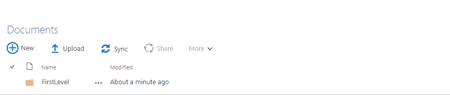

# Add breadcrumb to SharePoint List View Web Parts

Create a breadcrumb for each List View Web Part on SharePoint classic page, to enable you to navigate through folders structure.

It's built with React and Fabric UI.



Requirements
-------------
Node.js & NPM

Usage
-----
```
git clone https://github.com/RiccardoGDev/sp-breadcrumb.git
cd breadcrumb
npm install
npm run build
```

Then you can find the bundeled script to folder breadcrumb/dist and you need to inject it into the SharePoint page.
